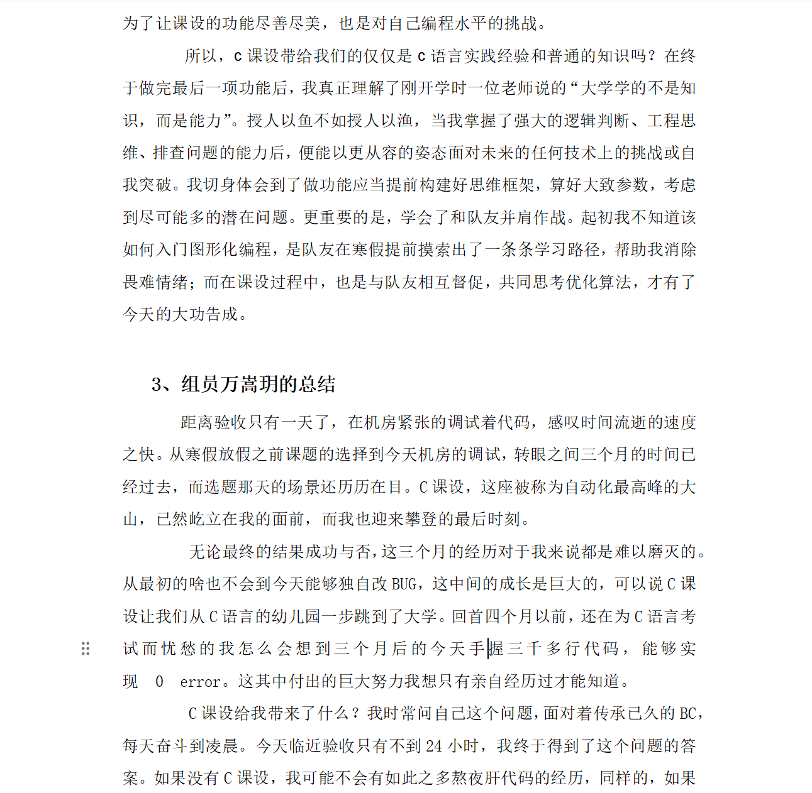

### 初始界面：

  

---

上传的时候回看当时终期报告里写的总结，突然意识到自己的C课设都已经过去两年了，令人感慨。当年还没入学就听说的A院传世经典，因为课程设计的落后和多方面的不合理性被历届学长学姐骂了四年，曾经以为是难以逾越的大山，现在看来却也不过如此。

作为手搓代码时代末期的产物，感觉对当时初学编程的自己来说，完成整个项目的规划还是有很大帮助的，虽然当时成就感满满的代码现在看来相当一坨，但也是本科期间能力提升的里程碑。

>现在是2023年4月20日的深夜，我正在光电大楼写课设总结。仅仅三个月前，我还不知道图形化编程的底层原理，不知道上个学期学的那些c语言理论知识该怎么用，不知道往届代码里那些花里胡哨的功能如何实现…

>最初选择这个题目，是考虑到目标功能比较明确，相对来说容易实现一些。一月份刚确定选题时，我和队友在对图形化编程一无所知的情况下，研究学长学姐的代码，并通过课本学习graphics库的函数功能。时至今日，我仍然记得第一次打开图形化界面并画出第一个矩形时那种发现了新大陆的兴奋感。经过不断的摸索，我们从一开始的迷茫，到前中期的信心，再到后期的成就感，这其中经历了太多曲折和挣扎，但也正是这些困难使我逐步变强。
>我依然记得每一次周末早早来到梧桐语咖啡馆，打开电脑开始一天的课设任务时意气风发的状态。我每次都会提前定下当天要完成的功能，想好代码的大致逻辑，并在编写过程中不断优化。有时候，一个小小的bug（诸如打开文件时用相对路径方法有误导致数据错乱）能消耗掉一整个下午的时间，而往往会因为灵光一现或者仔细地排查而欣喜若狂。每一个难以攻克的bug经过自己的不懈努力被攻破时，我都会感觉那些大量的被消耗的时间都意义非凡，是那些被逼入绝境、黔驴技穷时的痛苦让我变得更加坚毅不屈，是那些攻克难关、实现算法时的喜悦让我更相信了自己的能力。每当我被一个问题卡得寸步难行，甚至想放弃这条思路时，都会想“再试试吧”，然后根据问题所在追根溯源，用控制变量法找出藏匿深处的bug。由于源文件无法脱离工程而实现功能，我常常需要将源文件剥离出来，放到单独的测试文件中调试，一步一步查看运行过程中变量的值是否符合目标。尤其是在读取person.txt中的2400个数据时，一旦出错很难排查出问题的根源，而这往往要耗费半天的时间。然而，每当我处理完bug，背着沉重的电脑，乘着夜色回到宿舍时，都有一种事了拂衣去，深藏功与名的成就感，那与三个月前刚学完理论知识时大脑空空的懵懂感觉截然不同。久而久之，我越发相信自己的实力，相信不放弃就能做成任何我想实现的功能。因此，我才有足够的自信在验收前天（也就是今天）新加入交流室这个相对陌生的功能，这既是为了让课设的功能尽善尽美，也是对自己编程水平的挑战。
>所以，c课设带给我们的仅仅是c语言实践经验和普通的知识吗？在终于做完最后一项功能后，我真正理解了刚开学时一位老师说的“大学学的不是知识，而是能力”。授人以鱼不如授人以渔，当我掌握了强大的逻辑判断、工程思维、排查问题的能力后，便能以更从容的姿态面对未来的任何技术上的挑战或自我突破。我切身体会到了做功能应当提前构建好思维框架，算好大致参数，考虑到尽可能多的潜在问题。更重要的是，学会了和队友并肩作战。起初我不知道该如何入门图形化编程，是队友在寒假提前摸索出了一条条学习路径，帮助我消除畏难情绪；而在课设过程中，也是与队友相互督促，共同思考优化算法，才有了今天的大功告成。

  

