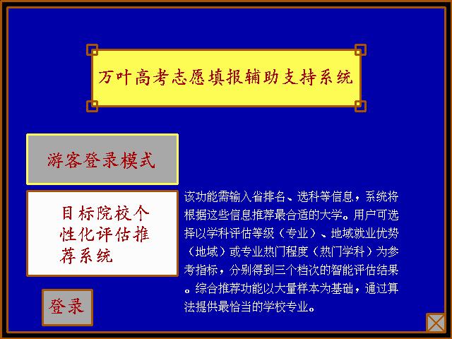

## 课设介绍

华中科技大学人工智能与自动化学院22级大一课程《C语言课程设计》代码，基于BorlandC的高考志愿填报智能推荐系统，获双A评级。核心算法为基于KNN的智能推荐功能和个性化问卷调查系统，总代码量10k+。作者：叶庭宏 万嵩玥

### 初始界面：

  

---

上传的时候回看当时终期报告里写的总结，突然意识到自己的C课设都已经过去两年了，令人感慨。当年还没入学就听说的A院传世经典，因为课程设计的落后和多方面的不合理性被历届学长学姐骂了四年，曾经以为是难以逾越的大山，现在看来却也不过如此。

作为手搓代码时代末期的产物，感觉对当时初学编程的自己来说，完成整个项目的规划还是有很大帮助的，虽然当时成就感满满的代码现在看来相当一坨，但也是本科期间能力提升的里程碑。

>"Many things are only trivial once you know them." - Herman Chernoff

